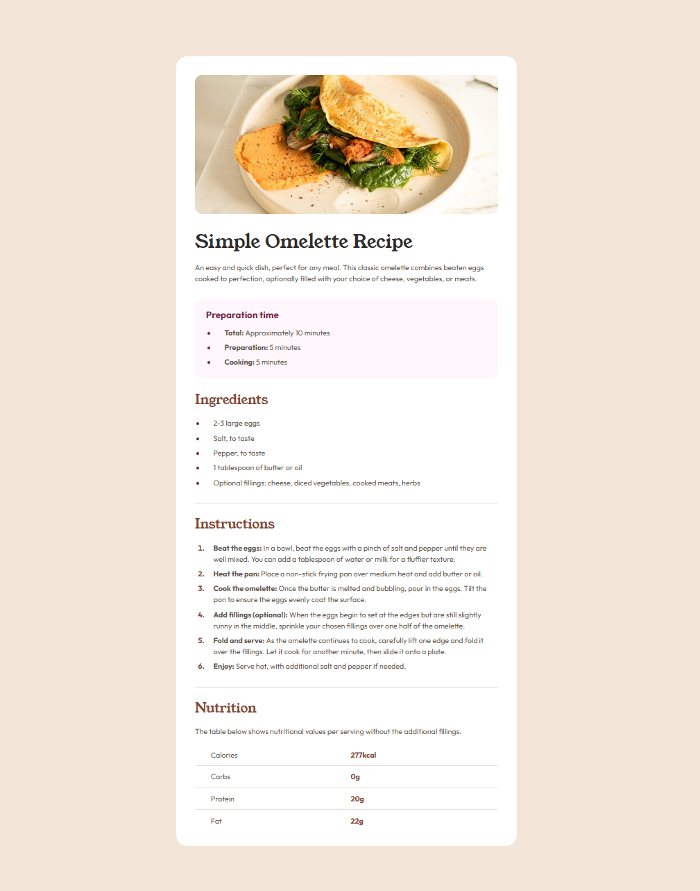

# Recipe Page component - Frontend Mentor challenge

Простий компонент сторінки рецепту, який включає поділ частин на розділи, використання невпорядкованих та впорядкованих списків і невелику таблицю.

## Навігація

- [Огляд](#огляд)
  - [Зображення](#зображення)
  - [Опис завдання](#опис-завдання)
  - [Використані технології](#використані-технології)
  
- [Висновки](#висновки)
  - [Мої досягнення](#мої-досягнення)
- [Більше про мене](#більше-про-мене)

## Огляд

### Зображення

### Опис завдання

Це завдання допоможе вам зосередитися на написанні семантичного HTML. Переконайтеся, що ви продумали, які елементи HTML найкраще підходять для кожного фрагмента контенту.
Ваше завдання — створити цю сторінку рецепту та зробити її максимально наближеною до дизайну.

Ви можете використовувати будь-які інструменти, які вам подобаються, щоб допомогти вам виконати завдання. Тож, якщо у вас є щось, що ви хотіли б попрактикувати, сміливо спробуйте.

### Використані технології

- HTML5 для розмітки
- CSS3 стилізація
- Flexbox

## Висновки

Сам компонент дуже легко зібрати, загалом не було жодних труднощів зі створенням стилів, але головним викликом було побудування розмітки відповідно до семантики. Використання відповідних тегів для конкретних елементів є дуже важливим завданням, оскільки результат суттєво впливає на зручність навігації сторінкою та якісну співпрацю з пошуковими системами.

### Мої досягнення

Робота з таким типом розмітки може бути виснажливою та вимагає ретельного підходу. Для мене одним із досягнень було створення стилізованих пропорційних списків і таблиць, оскільки до цього я зазвичай не мала практики стилізації всіх їхніх елементів і здебільшого мала можливість уникнути цього, магічним чином видаляючи маркери елементів. Тож цього разу я мала практику з цим завданням і змогла сконцентрувати увагу на важливості побудови усіх складових елементів.

## Більше про мене

Ви можете знайти мій персональний веб-сайт з портфоліо моїх робіт за посиланням https://solvixcode.com/

- GitHub https://github.com/Olha-Fursova
- LinkedIn https://www.linkedin.com/in/olha-fursova-6727b7265/
- Frontend Mentor https://www.frontendmentor.io/profile/Olha-Fursova
- Twitch https://www.twitch.tv/solvixcode/
